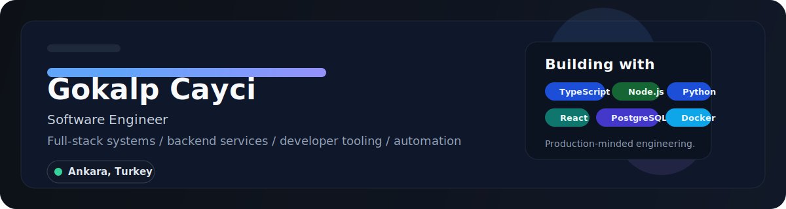

  

  
  
  

## About Me

I build software meant to be used, maintained, and improved over time.
My work usually sits around product development, backend architecture, automation, and developer experience.

I care about systems that stay clear as they grow: clean code, practical tooling, reliable APIs, and products people can actually use.

<table>
  <tr>
    <td valign="top" width="50%">

### What I Work On

- Full-stack products with clear UX and solid engineering fundamentals
- Backend services and APIs with clean structure and maintainable code
- Internal tools and automation that remove repetitive work
- Experiments in frontend polish, graphics, and applied ML

  </td>
    <td valign="top" width="50%">

### Current Focus

- Stronger portfolio projects with better product presentation
- Better system design, maintainability, and engineering depth
- Projects that show execution, not only experimentation

  </td>
  </tr>
</table>

## Core Stack

  
  
  
  
  
  

  
  
  
  

## Featured Projects

| Project | What it shows | Stack |
| --- | --- | --- |
| [`shaders`](https://github.com/gokalpcayci/shaders) | Package-minded graphics work with reusable canvas shader tooling | TypeScript |
| [`gemini-desktop`](https://github.com/gokalpcayci/gemini-desktop) | Desktop-app direction and Python application work | Python |
| [`ders-kayit-bot`](https://github.com/gokalpcayci/ders-kayit-bot) | Practical automation project built around real workflow needs | Python |
| [`PyTorch-Studies`](https://github.com/gokalpcayci/PyTorch-Studies) | Applied ML study repo showing experimentation and learning depth | Python |

## Engineering Style

- Clear architecture over clever complexity
- Useful automation over repetitive manual work
- Product thinking paired with maintainable implementation
- Fast iteration without losing readability

## Connect

  <a href="https://github.com/gokalpcayci">GitHub</a>
  <!-- Add LinkedIn and portfolio when ready. -->

<!-- Optional:

  <a href="https://linkedin.com/in/YOUR_HANDLE">LinkedIn</a>
  ·
  <a href="https://YOUR_SITE">Website</a>

-->
